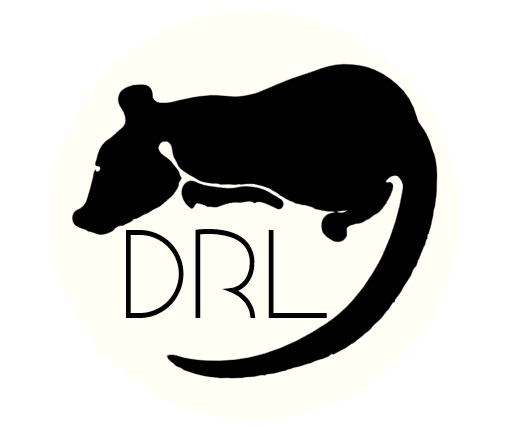

<!--
*** Thanks for checking out the Best-README-Template. If you have a suggestion
*** that would make this better, please fork the repo and create a pull request
*** or simply open an issue with the tag "enhancement".
*** Thanks again! Now go create something AMAZING! :D
***
***
***
*** To avoid retyping too much info. Do a search and replace for the following:
*** dsmordasov, dmitrijs_roguelike, twitter_handle, d.s.mordasov@protonmail.com, Dmitrij's Roguelike, v0.1 The Rat Catcher
-->


<!-- PROJECT SHIELDS -->
<!--
*** I'm using markdown "reference style" links for readability.
*** Reference links are enclosed in brackets [ ] instead of parentheses ( ).
*** See the bottom of this document for the declaration of the reference variables
*** for contributors-url, forks-url, etc. This is an optional, concise syntax you may use.
*** https://www.markdownguide.org/basic-syntax/#reference-style-links
-->
[![Contributors][contributors-shield]][]
[![Stargazers][stars-shield]][stars-url]
[![Issues][issues-shield]][issues-url]
[![MIT License][license-shield]][license-url]
[![LinkedIn][linkedin-shield]](www.linkedin.com/in/dsmordasov)


<!-- PROJECT LOGO -->
<br />
<p align="center">
  <a href="https://github.com/dsmordasov/dmitrijs_roguelike">
    
  </a>

  <h3 align="center">Dmitrij's Roguelike</h3>

  <p align="center">
    v0.1 The Rat Catcher
    <br />
    <a href="https://github.com/dsmordasov/dmitrijs_roguelike"><strong>Download and play! »</strong></a>
    <br />
    <br />
    <a href="https://github.com/dsmordasov/dmitrijs_roguelike">View Demo</a>
    ·
    <a href="https://github.com/dsmordasov/dmitrijs_roguelike/issues">Report Bug</a>
    ·
    <a href="https://github.com/dsmordasov/dmitrijs_roguelike/issues">Request Feature</a>
  </p>
</p>


<!-- TABLE OF CONTENTS -->
<details open="open">
  <summary><h2 style="display: inline-block">Table of Contents</h2></summary>
  <ol>
    <li>
      <a href="#about-the-project">About The Project</a>
      <ul>
        <li><a href="#built-with">Built With</a></li>
      </ul>
    </li>
    <li>
      <a href="#getting-started">Getting Started</a>
      <ul>
        <li><a href="#prerequisites">Prerequisites</a></li>
        <li><a href="#installation">Installation</a></li>
      </ul>
    </li>
    <li><a href="#usage">Usage</a></li>
    <li><a href="#roadmap">Roadmap</a></li>
    <li><a href="#contributing">Contributing</a></li>
    <li><a href="#license">License</a></li>
    <li><a href="#contact">Contact</a></li>
    <li><a href="#acknowledgements">Acknowledgements</a></li>
  </ol>
</details>


<!-- ABOUT THE PROJECT -->
## About The Project

[![Product Name Screen Shot][product-screenshot]](https://example.com)

A short Roguelike game based on the book [**Krysař** (The Ratcatcher) by **_Viktor Dyk_**, done as a hobby programming/game dev project by a student with definitely not enough free time to be doing such things. 

I have hardly put away any time to play videogames since I started my studies in Aerospace Engineering, almost five years ago now, at TU Delft. So, if you've no time to play videogames, what better way for a busy student to replace it with an even more time-demanding pastime - videogame development!


### Built With

* [libtcod](https://github.com/libtcod/libtcod)
* [NumPy](https://numpy.org/)
* [PyInstaller](https://www.pyinstaller.org/)

### The Ratcatcher?

I chose to base the `v0.1` version of my Roguelike on the Czech novella [**Krysař** (The Ratcatcher) by **_Viktor Dyk_**](https://www.goodreads.com/book/show/23366314-the-ratcatcher?from_search=true&from_srp=true&qid=Kjq0Tbh8df&rank=9).

If you know me in real life, you might have noticed that I read a lot, and since this was supposed to be mainly a programming pastime, I chose to outsource the story and world creation to someone who is better at it than me. There are a plethora of fantastic universes I know I could base the game on, yet I did not need anything too large for my `v0.1`. To venture out into the worlds of say, Tolkien, Herbert or Sapkowski for such a small game... it would feel like going on an arduous pilgrimage to the largest shopping mall in your city, just to buy a pack of gum.

I would definitely recommend the book to an undoubted person of taste such as you (well, you did get this far into my readme, didn't you?). It is short, beautiful, and packs a punch. Most Czechs know it, as it is neither too difficult nor long on one's reading list for the Maturita national high school exams. I drew it for mine.

On top of that, rats are an established RPG first enemy trope, so why not have a game with nothing but them?

<!-- GETTING STARTED -->
## Playing the game

To get the game up and running, just download one of the latest `v0.1` release builds (Win, Mac and Linux friendly :heart:) [here]()! 

### Playing around with the code

I have included a `requirements.txt` file, so after cloning the GitHub repo there's everything you need to set up your own virtual environment. Once you do, run the game from `main.py` and play around with the code as much as you want! 

 If you want to build the game on your machine, just run
 ```sh
 pip install pyinstaller
 ```
 and once it's done, 
 ```sh
 pyinstaller build.spec
 ```
 I have spent way too much time debugging and perfecting the `build.spec` file for PyInstaller, the meme that Python apps are completely undeployable is a filthy lie (as long as PyInstaller is sufficient for your small needs).

<!-- ROADMAP -->
## Roadmap

 The Rat Catcher (aka `v0.1`)

## Lessons Learned
Whilst I have known about the concept of _feature creep_, this project taught me its essence by taking the concept and beating my head violently with it for days on end. The list of features I want to add is expanding almost as quick as the universe, and I have no idea how anyone with a serious project over at /r/roguelikedev gets anything done in their real life. 

An hour (or two, although usually few) spent once every evening improving another game system, designing the player experience or just plain debugging after programming wind turbine BEM aeroelastic codes and planning imaginary wind farms the whole day relaxed me more than I would think.

I have found out that Game development is the software equivalent of aerospace engineering - the systems you build are complex, need too much time frankly and make you want to go full-time immediately. I enjoy fine literature, photography and pick up my guitar/uke and sing which provides me with infinite joy, but to make a proper game, there is so much digital music, art and game design that one should learn, that I can see why indie game devs usually only succeed if they have some money put away so that they could sink a few years into their passion projects.  

 

<!-- CONTRIBUTING -->
## Contributing

Contributions are what make the open source community such an amazing place to learn, inspire, and create. Having said that, **hands off**. This is a hobby project of mine, so no, I'm not letting you contribute without a good reason.

<!-- LICENSE -->
## License

Uhhhh... Look, I know that it's not too difficult to just put up a CC license or something, but I choose to leave that problem for future Dmitrij.

<!-- ACKNOWLEDGEMENTS -->
## Acknowledgements

* [The /r/roguelikedev 2020 tutorial, which provided the main game architecture and without which this project possible](http://rogueliketutorials.com/tutorials/tcod/v2/)
* [The /r/roguelikedev 2021 libtcod tutorial, which helped me start with PyInstaller, and even automate building and deployment through GitHub actions](https://libtcod.github.io/tutorials/python/2021/)
* [The Hoth Logomaker](https://logomaker.thehoth.com), along with [this image to .ico converter](https://image.online-convert.com/convert-to-ico)
* [AbuDhabi/Anno for the 16x16 ASCII tileset, originally meant for Dwarf Fortress](https://dwarffortresswiki.org/index.php/Tileset_repository#16.C3.9716)


<!-- MARKDOWN LINKS & IMAGES -->
<!-- https://www.markdownguide.org/basic-syntax/#reference-style-links -->
[contributors-shield]: https://img.shields.io/github/contributors/dsmordasov/repo.svg?style=for-the-badge
[contributors-url]: https://github.com/dsmordasov/dmitrijs_roguelike/graphs/contributors
[forks-shield]: https://img.shields.io/github/forks/dsmordasov/repo.svg?style=for-the-badge
[forks-url]: https://github.com/dsmordasov/dmitrijs_roguelike/network/members
[stars-shield]: https://img.shields.io/github/stars/dsmordasov/repo.svg?style=for-the-badge
[stars-url]: https://github.com/dsmordasov/dmitrijs_roguelike/stargazers
[issues-shield]: https://img.shields.io/github/issues/dsmordasov/repo.svg?style=for-the-badge
[issues-url]: https://github.com/dsmordasov/dmitrijs_roguelike/issues
[license-shield]: https://img.shields.io/github/license/dsmordasov/repo.svg?style=for-the-badge
[license-url]: https://github.com/dsmordasov/dmitrijs_roguelike/blob/master/LICENSE.txt
[linkedin-shield]: https://img.shields.io/badge/-LinkedIn-black.svg?style=for-the-badge&logo=linkedin&colorB=555
[linkedin-url]: https://linkedin.com/in/dsmordasov